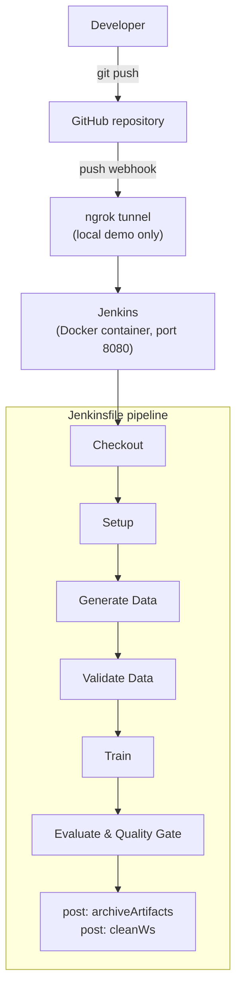

# Jenkins ML Pipeline — MLOps CI/CD Demonstration

A hands-on MLOps project showing how Jenkins can automate a machine-learning workflow and enforce quality controls on it: data validation before training, and a model quality gate after evaluation.

---

## Overview

This repository contains a small, self-contained ML workflow (synthetic data generation, data validation, model training and model evaluation) plus a declarative `Jenkinsfile` that runs those steps as a CI pipeline.

Jenkins is used as the **orchestration and automation layer**, not as the ML framework. The ML work itself is done by plain Python scripts using scikit-learn, pandas and matplotlib. Jenkins is responsible for:

- triggering the workflow (manually, or automatically on `git push` via a GitHub webhook),
- running each step in a fixed order inside a reproducible Python environment,
- stopping the pipeline when a step fails (bad data, or a model that is not good enough),
- archiving the resulting data, model and metrics for every build.

Each "gate" is implemented the same way: the Python script exits with a non-zero status code when a check fails, and Jenkins treats that as a failed stage. This keeps the quality logic in version-controlled code and the enforcement in the CI system.

Jenkins itself runs locally in Docker, using a custom image that adds Python to the official Jenkins LTS image.

---

## Architecture



**About ngrok:** in the local demo, Jenkins runs on `localhost:8080`, which GitHub cannot reach. ngrok was used only to expose that local instance through a public URL so GitHub could deliver webhook events. It is not part of the repository and is not needed when Jenkins is publicly reachable.

---

## Project Structure

```text
jenkins-mlops-demo/
├── docker/
│   └── Dockerfile          # Jenkins LTS (JDK 17) image + python3, venv, pip
├── src/
│   ├── generate_data.py    # Synthetic binary-classification dataset -> train/test CSVs
│   ├── validate_data.py    # Data-quality checks; non-zero exit on failure
│   ├── train.py            # Trains a RandomForestClassifier, saves model + metadata
│   └── evaluate.py         # Computes metrics, writes plot, enforces quality gate
├── docker-compose.yml      # Runs the Jenkins container (ports 8080, 50000)
├── Jenkinsfile             # Declarative pipeline definition (Pipeline as Code)
├── requirements.txt        # Pinned Python dependencies
├── .gitattributes          # Forces LF line endings for the Linux container
├── .gitignore              # Ignores .venv/, data/, artifacts/, caches
└── README.md
```

| File | Purpose |
|---|---|
| `Jenkinsfile` | Defines parameters, stages, and post-build actions (archive, cleanup). |
| `docker-compose.yml` | Builds the image from `./docker`, names the container `jenkins-mlops`, maps ports `8080` (web UI) and `50000` (agent port), and keeps Jenkins state in the `jenkins_home` named volume. |
| `docker/Dockerfile` | `FROM jenkins/jenkins:lts-jdk17`, installs `python3`, `python3-venv`, `python3-pip` so the pipeline can run Python on the built-in Jenkins node. |
| `requirements.txt` | `numpy==2.1.3`, `pandas==2.2.3`, `scikit-learn==1.5.2`, `joblib==1.4.2`, `matplotlib==3.9.2`. |
| `.gitattributes` | `* text=auto eol=lf`, so shell steps and scripts committed from Windows still run in the Linux container. |

`data/` and `artifacts/` are created at build time and are git-ignored.

---

## Jenkins Pipeline

The pipeline uses `agent any`, the `timestamps()` and `disableConcurrentBuilds()` options, and a per-workspace virtual environment at `${WORKSPACE}/.venv`.

| Stage | Command | Purpose |
|---|---|---|
| `Checkout` | `checkout scm` | Retrieves the repository revision that triggered the build. |
| `Setup` | `python3 -m venv "$VENV"` + `pip install -r requirements.txt` | Creates an isolated Python environment with pinned dependencies. |
| `Generate Data` | `python3 src/generate_data.py --class-sep ${CLASS_SEP}` | Generates `data/train.csv` and `data/test.csv`. |
| `Validate Data` | `python3 src/validate_data.py` | Runs automated data-quality checks; fails the build on bad data. |
| `Train` | `python3 src/train.py` | Trains the model and writes it to `artifacts/`. |
| `Evaluate & Quality Gate` | `python3 src/evaluate.py --threshold ${THRESHOLD} --metric accuracy` | Computes metrics and fails the build if accuracy is below the threshold. |

Post-build actions:

| Condition | Action |
|---|---|
| `always` | Archive `artifacts/*` and `data/*.csv` (see [Artifacts](#artifacts)). |
| `success` | Log `Build OK — model passed the quality gate.` |
| `failure` | Log `Build FAILED — check which stage broke (validation / gate / setup).` |
| `cleanup` | `cleanWs()` deletes the workspace. |

Archiving is not a separate stage. It runs in the `post { always { ... } }` block, so it happens even when an earlier stage fails.

---

## Data Validation

`src/validate_data.py` loads `data/train.csv` and `data/test.csv` and runs the following checks on **each** split:

| Check | Fails when |
|---|---|
| Minimum row count | `len(df) < --min-rows` (default `100`) |
| Required target column | the `target` column is missing. If so, the remaining checks are skipped for that split. |
| Null values | any cell in the DataFrame is null |
| Number of target classes | `target` has fewer than 2 unique values |
| Class imbalance | the smallest class makes up less than 10% of rows |

All errors are collected and printed under `DATA VALIDATION FAILED:`, then the script calls `sys.exit(1)`. Jenkins `sh` steps fail on a non-zero exit code, so the `Validate Data` stage fails and the remaining stages are skipped:

```text
Invalid data
   → validate_data.py exits 1
   → Validate Data stage FAILED
   → Train and Evaluate do NOT run
```

This is the key MLOps idea here: bad data is caught **before** compute is spent training on it, and before a model built on it can be produced.

---

## Model Training and Evaluation

### Dataset

`src/generate_data.py` uses `sklearn.datasets.make_classification` to build a synthetic **binary classification** dataset:

| Setting | Default |
|---|---|
| Samples | 2000 |
| Features | 20 (`f0` … `f19`) |
| Informative features | 10 (`n_features // 2`) |
| Redundant features | 2 |
| Class separation | `--class-sep` (default `1.0`; set from the `CLASS_SEP` parameter in Jenkins) |
| Random seed | 42 |

The data is split 80/20 with stratification on `target`, which gives **1600 training rows** and **400 test rows** by default.

### Training

`src/train.py` trains a `RandomForestClassifier` (`n_estimators=200`, `random_state=42`, `n_jobs=-1`) on `data/train.csv`.

### Evaluation

`src/evaluate.py` loads the model, predicts on `data/test.csv`, and computes:

| Metric | Implementation |
|---|---|
| `accuracy` | `accuracy_score` |
| `f1` | `f1_score` |
| `roc_auc` | `roc_auc_score` on the positive-class probability |

It also renders a confusion matrix using the headless `Agg` matplotlib backend, since there is no display in CI.

### Generated files

| File | Produced by | Contents |
|---|---|---|
| `data/train.csv`, `data/test.csv` | `generate_data.py` | Features `f0`–`f19` and `target` |
| `artifacts/model.pkl` | `train.py` | Serialized model (joblib) |
| `artifacts/train_meta.json` | `train.py` | `n_estimators`, `n_train_rows`, feature list |
| `artifacts/metrics.json` | `evaluate.py` | `accuracy`, `f1`, `roc_auc` |
| `artifacts/confusion_matrix.png` | `evaluate.py` | Confusion matrix plot |

---

## Model Quality Gate

The `Evaluate & Quality Gate` stage passes the `THRESHOLD` build parameter to `evaluate.py` and selects accuracy as the gating metric:

```bash
python3 src/evaluate.py --threshold ${THRESHOLD} --metric accuracy
```

The script logic is:

```text
accuracy >= threshold
    → prints "QUALITY GATE PASSED."
    → exit 0 → build succeeds

accuracy < threshold
    → prints "QUALITY GATE FAILED: accuracy <value> < <threshold>"
    → exit 1 → stage fails → build fails
```

`metrics.json` and `confusion_matrix.png` are written **before** the gate check, so they are still archived when the gate fails. You can see exactly why the model was rejected.

`evaluate.py` also supports `--metric f1` and `--metric roc_auc`, but the `Jenkinsfile` uses `accuracy`.

---

## Jenkins Parameters

The `Jenkinsfile` defines exactly two string parameters:

| Parameter | Default | Used by | Effect |
|---|---|---|---|
| `THRESHOLD` | `0.85` | `evaluate.py --threshold` | Minimum accuracy the model must reach to pass the quality gate. |
| `CLASS_SEP` | `1.0` | `generate_data.py --class-sep` | How separable the two classes are in the synthetic data. Lower values make the data harder and usually lower accuracy. |

The two parameters act on different things:

- **`CLASS_SEP` changes the data.** It affects how good the trained model can be.
- **`THRESHOLD` changes the acceptance criterion.** It decides whether the resulting model is good enough.

You can therefore fail the quality gate in two ways: raise the bar (`THRESHOLD`), or make the problem harder (`CLASS_SEP`).

---

## Failure Scenarios Demonstrated

### 1. Data validation failure

The validation gate was triggered on purpose by raising the minimum row count in the `Validate Data` stage of the `Jenkinsfile` (see commit `97de878`, "Demo data validation failure"):

```bash
python3 src/validate_data.py --min-rows 10000
```

The generated dataset has 1600 train rows and 400 test rows by default, so both splits fail the row-count check:

```text
DATA VALIDATION FAILED:
  - train: only 1600 rows (< 10000)
  - test: only 400 rows (< 10000)
```

Pipeline behaviour:

```text
Generate Data
      ↓
Validate Data → FAILED
      ↓
Train / Evaluate do NOT run
```

`data/*.csv` is still archived (the `artifacts/` directory does not exist yet, which `allowEmptyArchive: true` tolerates). The change was then reverted (commit `704ada6`, "Restore normal data validation").

### 2. Model quality gate failure

Running **Build with Parameters** with:

```text
THRESHOLD = 0.99
CLASS_SEP = 1.0
```

causes the gate to fail. In the project demonstration the model scored:

```text
accuracy = 0.915     (observed in the demo)
```

Since `0.915 < 0.99`, `evaluate.py` exits 1 and the build fails at `Evaluate & Quality Gate`. The exact accuracy you get depends on the parameters and library versions. 0.915 is the observed demo value, not a guaranteed result.

You can get the same effect by keeping `THRESHOLD = 0.85` and lowering `CLASS_SEP` until accuracy drops below the threshold.

---

## GitHub Webhook Integration

A GitHub webhook starts the pipeline automatically on every push, so nobody has to click **Build** after each commit:

```text
git push
   ↓
GitHub
   ↓
Webhook (push event)
   ↓
Jenkins
   ↓
Pipeline starts automatically
```

In the local demonstration, Jenkins was not publicly reachable, so ngrok forwarded the webhook:

```text
GitHub
   ↓
Webhook
   ↓
ngrok (public URL)
   ↓
localhost:8080
   ↓
Jenkins
```

The webhook trigger is configured in the Jenkins job and in GitHub, not in the `Jenkinsfile`:

- **GitHub:** repository → *Settings* → *Webhooks* → payload URL `https://<public-jenkins-host>/github-webhook/`, content type `application/json`, event: *Just the push event*.
- **Jenkins job:** under *Triggers*, enable **GitHub hook trigger for GITScm polling**.

With ngrok, `<public-jenkins-host>` is the forwarding hostname ngrok assigns to `localhost:8080`. Free ngrok URLs can change between sessions, so the webhook URL may need updating.

---

## Running the Project Locally

### Prerequisites

- Docker with Docker Compose (Docker Desktop on Windows/macOS, Docker Engine on Linux)
- Git
- Optional: ngrok, only for webhook delivery to a local Jenkins

### Start Jenkins

```powershell
cd <project-directory>        # e.g. E:\jenkins-mlops-demo
docker compose up -d --build
```

Check that the container is running:

```powershell
docker compose ps
```

Jenkins is available at **http://localhost:8080**. Port `50000` is also mapped for inbound agents, but this pipeline runs on the built-in node and doesn't use it.

For first-time setup, get the initial admin password:

```powershell
docker exec jenkins-mlops cat /var/jenkins_home/secrets/initialAdminPassword
```

Open http://localhost:8080, enter the password, choose **Install suggested plugins**, and create an admin user. The pipeline relies on the Pipeline, Git, GitHub, Timestamper and Workspace Cleanup plugins.

### Run the scripts without Jenkins (optional sanity check)

```bash
pip install -r requirements.txt
python3 src/generate_data.py
python3 src/validate_data.py
python3 src/train.py
python3 src/evaluate.py --threshold 0.85
```

### Stop / tear down

```powershell
docker compose down        # stop Jenkins, keep the jenkins_home volume
docker compose down -v     # also delete all Jenkins data
```

---

## Jenkins Setup

Minimum job configuration:

1. **New Item** → enter a name → select **Pipeline** → OK
2. **Pipeline** section:
   - **Definition:** Pipeline script from SCM
   - **SCM:** Git
   - **Repository URL:** your fork or clone of this repository
   - **Branch Specifier:** `*/main`
   - **Script Path:** `Jenkinsfile`
3. *(Optional, for webhooks)* **Triggers:** enable **GitHub hook trigger for GITScm polling**
4. Save

Credentials are only needed if the repository is private. In that case, add a GitHub credential (for example a personal access token) in Jenkins and select it in the SCM configuration. Never commit tokens or webhook secrets to the repository.

---

## Build with Parameters

Parameters are defined in the `Jenkinsfile`. Jenkins only registers them after the job has run once, so the first build may run with defaults. After that, use **Build with Parameters**:

```text
THRESHOLD = 0.85
CLASS_SEP = 1.0
```

These are the defaults and should give a passing build. Changing the values shows the quality gate in action:

| Run | `THRESHOLD` | `CLASS_SEP` | Expected outcome |
|---|---|---|---|
| Baseline | `0.85` | `1.0` | Passes (demo accuracy ≈ 0.915) |
| Raise the bar | `0.99` | `1.0` | Fails at `Evaluate & Quality Gate` |
| Harder data | `0.85` | lower than `1.0` | Accuracy drops; fails once it falls below 0.85 |

Builds started by a webhook use the default parameter values.

---

## Artifacts

```groovy
post {
  always {
    archiveArtifacts artifacts: 'artifacts/*, data/*.csv',
                     allowEmptyArchive: true, fingerprint: true
  }
  cleanup { cleanWs() }
}
```

| Option | Meaning |
|---|---|
| `artifacts: 'artifacts/*, data/*.csv'` | Archive everything in `artifacts/` (`model.pkl`, `train_meta.json`, `metrics.json`, `confusion_matrix.png`) and the `train.csv` / `test.csv` datasets. |
| `allowEmptyArchive: true` | Don't fail the build if some patterns match nothing, e.g. when the build stops before `artifacts/` is created. |
| `fingerprint: true` | Record a checksum of each archived file so Jenkins can track which builds produced or used a given file. |
| `always` | Archive on success **and** on failure, so failed builds keep their evidence. |

**Workspace vs. archived artifacts**

- The **workspace** is the temporary working directory on the Jenkins node where the repo is checked out and the scripts run. It holds `.venv/`, `data/` and `artifacts/` during the build.
- **Archived artifacts** are copies that Jenkins stores with the build record under `jenkins_home`. You can download them from the build page under *Build Artifacts*.

Because `cleanWs()` runs in the `cleanup` block (after all other post conditions), the workspace is deleted at the end of every build. The archived copies are the only files that persist, and each build starts from a clean workspace.

---

## Example Successful Run

Metrics observed in the project demonstration with the default parameters (`THRESHOLD = 0.85`, `CLASS_SEP = 1.0`):

```text
accuracy = 0.915
f1       = 0.918
roc_auc  = 0.972

Quality gate: accuracy=0.9150 vs threshold=0.85
QUALITY GATE PASSED.
```

These are example results from the demo, not guaranteed values.

---

## What This Demonstrates

- **Pipeline as Code:** the workflow is defined in a version-controlled `Jenkinsfile`.
- **Continuous Integration:** every push can trigger a full data-to-evaluation run.
- **Automated data validation:** bad data stops the pipeline before training.
- **Automated model evaluation:** metrics are computed and recorded on every build.
- **Model quality gates:** a model below the accuracy threshold fails the build.
- **Parameterized builds:** `THRESHOLD` and `CLASS_SEP` change behaviour without code changes.
- **Webhook-triggered automation:** a GitHub push starts the pipeline.
- **Artifact archiving:** data, model, metrics and plots are kept for every build.
- **Reproducible execution:** a containerized Jenkins, a fresh venv, pinned dependencies, fixed random seeds, and a clean workspace per build.

---

## Limitations / Scope

This is a CI demonstration. It does **not** implement:

- Model deployment or model serving
- Docker image publishing or a container registry
- Kubernetes or any cloud infrastructure; Jenkins runs locally
- Experiment tracking or a model registry (e.g. MLflow); models exist only as Jenkins build artifacts
- Real-world data sources; the dataset is synthetic
- Production monitoring, drift detection, or automated rollback
- Distributed Jenkins agents; all stages run on the built-in node
- Automated unit tests for the Python scripts

---

## Key Takeaway

Jenkins does not replace the ML tools used for data processing, training, or evaluation. It provides the automation and orchestration layer that turns those individual steps into a repeatable CI/CD workflow with automated quality controls.
